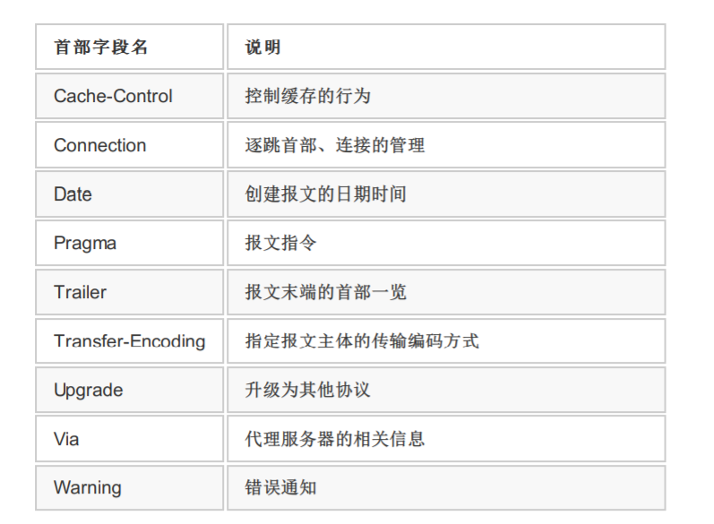
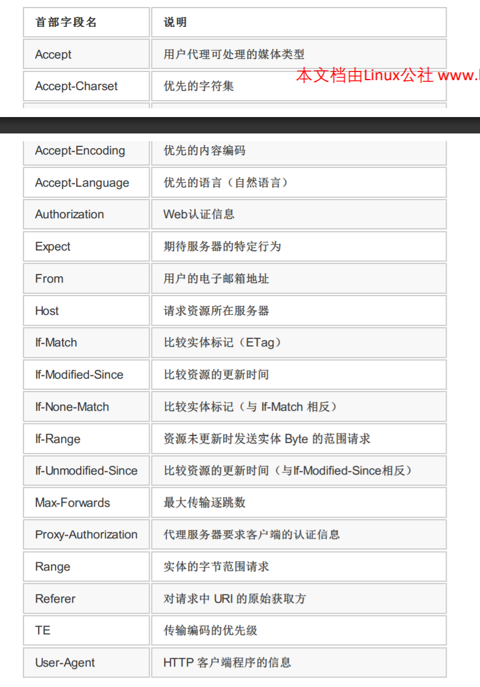
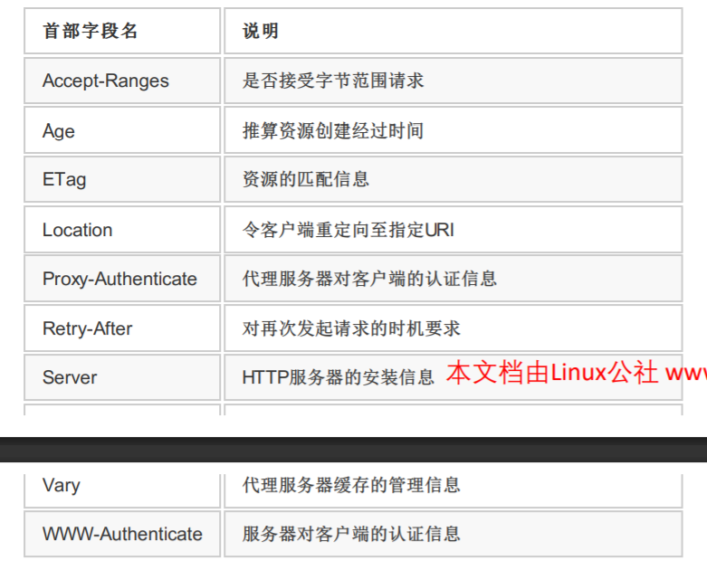
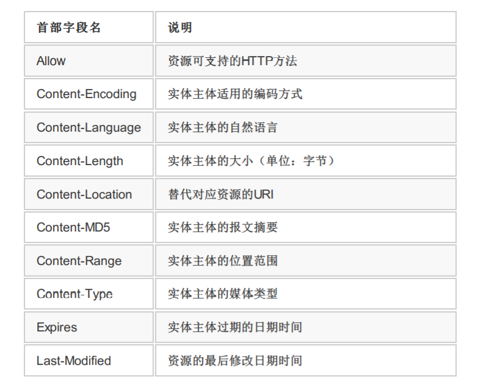
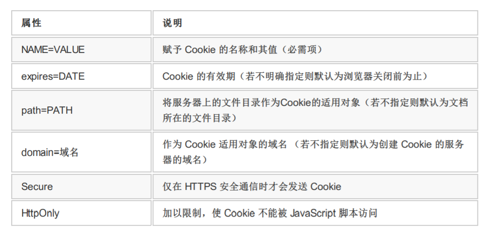
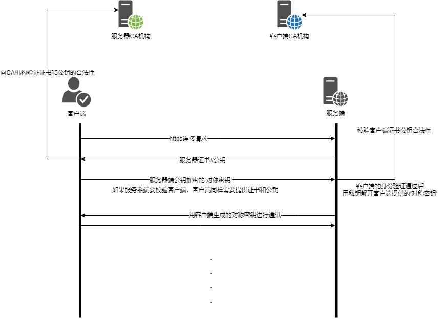
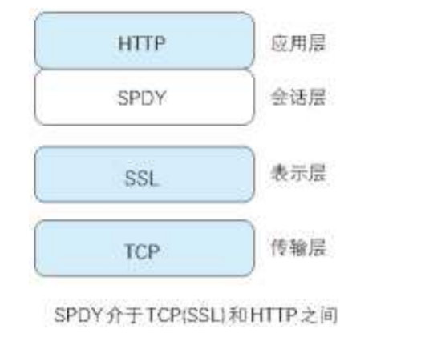
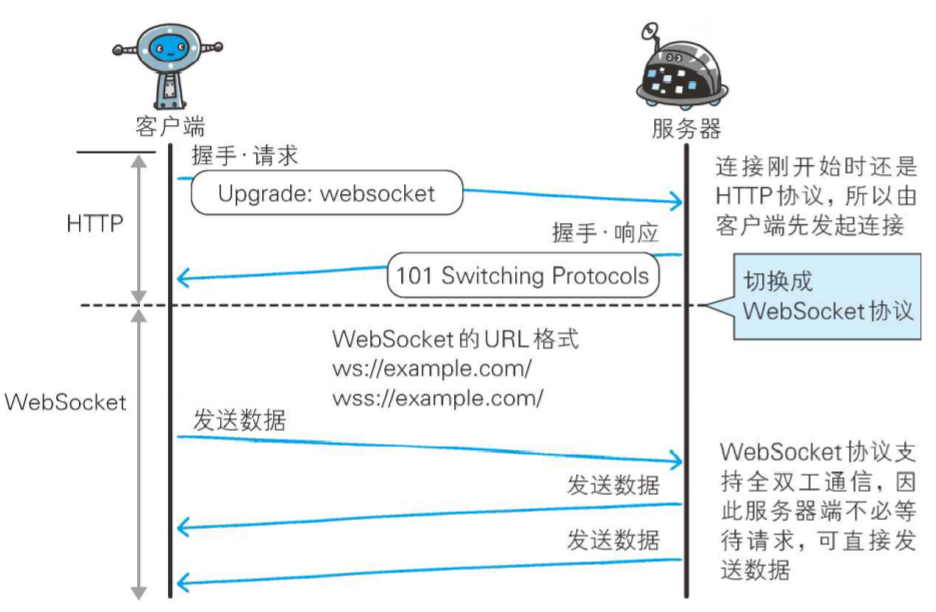

### (TCP粘包问题)[https://draveness.me/whys-the-design-tcp-message-frame/]
* TCP协议是面向字节流的传输协议
* 应用层协议没有定义消息的边界导致数据的接收方无法正确解析数据
实际上不存在TCP粘包问题,TCP协议解决的是传输的可靠性和顺序性（三次握手）

### URI,URL,URN的区别
* URI (Uniform Resource Identifier)
* URL (Uniform Resource Locator)
* URN (Uniform Resource Name)
URI 包括 URL,URN; URL和URN有交集

### http请求的cookie是由服务端生成并发送给客户端

### 网站安全相关

## 《图解HTTP》读书笔记
### htpp状态码
* 1XX Information 信息类状态码
* 2XX Success 成功状态码
    1. 200 OK 
    2. 204 No Content 没有内容更新不返回响应实体部分
    3. 206 Partial Content 响应报文包含Content-Range
* 3XX Redirection 重定向状态码
    1. 301 Moved Permanently 永久性重定向
    2. 302 Found 临时性重定向
    3. 303 See Other 临时性重定向 强制规定客户端必须以GET请求重定向链接
        >当 301、302、303 响应状态码返回时，几乎所有的浏览器都会把 POST 改成 GET，并删除请求报文内
        >的主体，之后请求会自动再次发送。
        >
        >301、302 标准是禁止将 POST 方法改变成 GET 方法的，但实际使用时大家都会这么做。
    4. 304 Not Modified 该状态码表示客户端发送[附带条件](#1)的请求 2 时，服务器端允许请求访问资源，但未满足条件的情况。304 状态码返回时，不包含任何响应的主体部分。

        *<em id="1">附带条件的请求是指采用 GET 方法的请求报文中包含 If-Match，If-Modified-Since，If-None-Match，If-Range，IfUnmodified-Since 中任一首部。</em>*
    5. 307 Temporary Redirect

        *307 会遵照浏览器标准，不会从 POST 变成 GET。但是，对于处理响应时的行为，每种浏览器有可能出现不同的情况。*
* 4XX Client Error 客户端错误
    1. 400 Bad Request
    2. 401 Unanthorized 需要通过http认证（BASIC 认证、DIGEST 认证）
    3. 403 Forbidden 请求被拒
    4. 404 Not Found
* 5XX Server Error 服务器错误
    1. 500 Internal Server Error 执行请求时发生了错误
    2. 503 Service Unavailable 超负载和停机维护，如知道解除状态需要的时间，应在首部字段添加RetryAfter字段

### 代理，网关，隧道
* 代理 根据是否使用缓存，是否修改报文分为两种 1. 缓存代理 2.透明代理（不修改报文）
    1. 代理的流程 a(客户端) <=> b(代理) <=> c(源服务器)
* 网关 可以处理http协议请求转发给其他服务器不通过http协议
    * a(客户端) [http] <=> 网关 [非http]<=> 源服务器
* 隧道 隧道本身不会去解析 HTTP 请求，目的是确保客户端能与服务器进行安全的通信。

### 其他应用层协议
* FTP(File Transfer Protocol) 历史久远比Http早，1973年 95年被http的流量超越

### HTTP/1.1首部字段
* 通用首部字段（General Header Fields）

    
* 请求首部字段（Request Header Fields）
    
    
* 响应首部字段（Response Header Fields）
    
    
* 实体首部字段（Entity Header Fields）
    
    
* 非Http/1.1的首部字段也在使用的Cookie、Set-Cookie 和 Content-Disposition等

* HTTP 首部字段将定义成缓存代理和非缓存代理的行为，分成 2 种类型。
    * 端到端首部（End-to-end Header）
        分在此类别中的首部会转发给请求 / 响应对应的最终接收目标，且必须保存在由缓存生成的响应中，另外规定它必须被转发。
    * 逐跳首部（Hop-by-hop Header）
        分在此类别中的首部只对单次转发有效，会因通过缓存或代理而不再转发。HTTP/1.1 和之后版本中，如果要使用 hop-by-hop 首部，需提供 Connection 首部字段。

        除这 8 个首部字段之外，其他所有字段都属于端到端首部
        * Connection
        * Keep-Alive
        * Proxy-Authenticate
        * Proxy-Authorization
        * Trailer
        * TE
        * Transfer-Encoding
        * Upgrade
* 为Cookie服务的首部字段
    * Set-Cookie 响应首部 开始状态管理所使用的Cookie信息（服务器端生成响应给客户端）
    * Cookie 请求首部 服务器接收到的Cookie信息（客户端发送给服务端）
    1. Set-Cookie字段属性

        
        * path属性可通过技术手段规避，安全机制效果不能抱有期待
        * domain的值与域名结尾匹配一致即可
        * secure 用于限制Web页面仅在https连接时，才发送Cookie
        * HttpOnly Cookie拓展功能，使js脚本无法获得Cookie,目的防止Xss（Cross-site scripting）（跨站脚本攻击）对Cookie信息的窃取, 最初不是为了防止Xss开发的
    2. Cookie

* Https协议

    

    https协议是在http通信接口部分用SSL/TLS协议代替
    1. SSL（Secure Socket Layer）和TLS（Transport Layer Security）的关系,。TSL 是以 SSL 为原型开发的协议，有时会统一称该协议为 SSL。当前主流的版本是 SSL3.0 和 TLS1.0。
    2. SSL协议可以分成两层，
        * SSL记录协议（SSL Record Protocol）,它建立在可靠的传输协议（如TCP）之上，为高层协议提供数据封装、压缩、加密等基本功能的支持。
        * SSL握手协议（SSL Handshake Protocol）,它建立在SSL记录协议之上，用于在实际的数据传输开始前，通讯双方进行身份认证、协商加密算法、交换加密密钥等。
    3. Https 比Http慢到2-100倍, 可用SSL加速器这种专用服务器来改善这个问题

* HTTP/1.1使用的认证方式
    * BASIC认证 基本认证
        * BASIC认证采用的Base64编码方式，不属于加密处理
        * 浏览器无法实现认证注销功能
    * DIGEST认证 摘要认证
        * 同样采用质询/响应的方式，但不发送明文密码采用MD5加密密码的方式
        * 浏览器无法实现认证注销功能 不够便捷，安全等级仍比较弱，不能排除中间人攻击
    * SSL客户端认证
    * FormBase认证 基于表单认证

* 基于HTTP的功能追加协议
    * Http的性能瓶颈
        * 一条连接上只可发送一个请求。
        * 请求只能从客户端开始。客户端不可以接收除响应以外的指令。
        * 请求 / 响应首部未经压缩就发送。首部信息越多延迟越大。
        * 发送冗长的首部。每次互相发送相同的首部造成的浪费较多。
        * 可任意选择数据压缩格式。非强制压缩发送
    * 出现的解决方案
        * Ajax 产生大量请求
        * Comet 模拟实现服务器端向客户端推送（Server Push）的功能, 相应的连接的持续时间变长
        * SPDY没有完全改写 HTTP 协议，而是在 TCP/IP 的应用层与运输层之间通过新加会话层的形式运作。同时，考虑到安全性问题，SPDY 规定通信中使用 SSL。

        
        >会话层的主要功能是在两个节点间建立、维护和释放面向用户的连接，并对会话进行管理和控制，保证会话数据可靠传送。
        >表示层主要是负责数据格式的转换，压缩与解压缩，加密与解密。

            * 多路复用流
                通过单一的 TCP 连接，可以无限制处理多个 HTTP 请求。所有请求的处理都在一条 TCP 连接上完成，因此TCP 的处理效率得到提高。
            * 赋予请求优先级
                SPDY 不仅可以无限制地并发处理请求，还可以给请求逐个分配优先级顺序。这样主要是为了在发送多个请求时，解决因带宽低而导致响应变慢的问题
            * 压缩 HTTP 首部
                压缩 HTTP 请求和响应的首部。这样一来，通信产生的数据包数量和发送的字节数就更少了
            * 推送功能
                支持服务器主动向客户端推送数据的功能。这样，服务器可直接发送数据，而不必等待客户端的请求
            * 服务器提示功能
                服务器可以主动提示客户端请求所需的资源。由于在客户端发现资源之前就可以获知资源的存在，因此在资源已缓存等情况下，可以避免发送不必要的请求。
    * WebSocket协议
        主要特点
        1. 推送共鞥
        2. 减少通信量
            * 只要建立起 WebSocket 连接，就希望一直保持连接状态。和 HTTP 相比，不但每次连接时的总开销减少，而且由于 WebSocket 的首部信息很小，通信量也相应减少了。
        WebSocket通信
            * **在 HTTP 连接建立之后**，需要完成一次“握手”（Handshaking）的步骤
                * 握手·请求
                * 握手·响应
                * 成功握手确立 WebSocket 连接之后，通信时不再使用 HTTP 的数据帧，而采用 WebSocket 独立的数据帧。

        
* Web 服务器及程序协作的 CGI
    1. CGI（Common Gateway Interface，通用网关接口）是指 Web 服务器在接收到客户端发送过来的请求后转发给程序的一组机制。
* 针对Web的攻击技术
    根据攻击模式分为两种
    1. 主动攻击
        主动攻击（active attack）是指攻击者通过直接访问 Web 应用，把攻击代码传入的攻击模式。由于该模式是直接针对服务器上的资源进行攻击，因此攻击者需要能够访问到那些资源。主动攻击模式里具有代表性的攻击是 SQL 注入攻击和 OS 命令注入攻击。
    
    2. 被动攻击
    
        被动攻击（passive attack）是指利用圈套策略执行攻击代码的攻击模式。在被动攻击过程中，攻击者不直接对目标 Web 应用访问发起攻击。

        被动攻击通常的攻击模式如下所示。

        * 步骤 1： 攻击者诱使用户触发已设置好的陷阱，而陷阱会启动发送已嵌入攻击代码的 HTTP 请求。
        * 步骤 2： 当用户不知不觉中招之后，用户的浏览器或邮件客户端就会触发这个陷阱。
        * 步骤 3： 中招后的用户浏览器会把含有攻击代码的 HTTP 请求发送给作为攻击目标的 Web 应用，运行攻击代码。
        * 步骤 4： 执行完攻击代码，存在安全漏洞的 Web 应用会成为攻击者的跳板，可能导致用户所持的Cookie 等个人信息被窃取，登录状态中的用户权限遭恶意滥用等后果。

        被动攻击模式中具有代表性的攻击是**跨站脚本攻击**和**跨站点请求伪造**。

    3. 以服务器为目标的主动攻击
    4. 以服务器为目标的被动攻击
    5. 利用用户的身份攻击企业内部网络
* 因输出值转义不完全引发的安全漏洞

        应对策略
        1. 客户端的验证
        2. Web 应用端（服务器端）的验证
            * 输入值验证
            * 输出值转义
    1. 跨站脚本攻击 跨站脚本攻击（Cross-Site Scripting，XSS）是指通过存在安全漏洞的 Web 网站注册用户的浏览器内运行非法的 HTML 标签或 JavaScript 进行的一种攻击。
    2. SQL 注入攻击 
    3. OS 命令注入攻击（OS Command Injection）是指通过 Web 应用，执行非法的操作系统命令达到攻击的目的。只要在能调用 Shell 函数的地方就有存在被攻击的风险。
    4. HTTP 首部注入攻击（HTTP Header Injection）是指攻击者通过在响应首部字段内插入换行，添加任意响应首部或主体的一种攻击。属于被动攻击模式。
        * 设置任何 Cookie 信息
        * 重定向至任意 URL
        * 显示任意的主体（HTTP 响应截断攻击）
    5. 邮件首部注入（Mail Header Injection）是指 Web 应用中的邮件发送功能，攻击者通过向邮件首部 To 或Subject 内任意添加非法内容发起的攻击。
    6. 目录遍历（Directory Traversal）攻击是指对本无意公开的文件目录，通过非法截断其目录路径后，达成访问目的一种攻击。这种攻击有时也称为路径遍历（Path Traversal）攻击。
    7. 远程文件包含漏洞（Remote File Inclusion）是指当部分脚本内容需要从其他文件读入时，攻击者利用指定外部服务器的 URL 充当依赖文件，让脚本读取之后，就可运行任意脚本的一种攻击。

* 因设置或设计上的缺陷引发的安全漏洞
    1. 强制浏览（Forced Browsing）安全漏洞是指，从安置在 Web 服务器的公开目录下的文件中，浏览那些原本非自愿公开的文件。就是被人猜到了文件路径
    2. 不正确的错误消息处理（Error Handling Vulnerability）的安全漏洞是指，Web 应用的错误信息内包含对攻击者有用的信息。与 Web 应用有关的主要错误信息如下所示。
    3. 开放重定向（Open Redirect）是一种对指定的任意 URL 作重定向跳转的功能。而于此功能相关联的安全漏洞是指，假如指定的重定向 URL 到某个具有恶意的 Web 网站，那么用户就会被诱导至那个 Web 网站。
* 因会话管理疏忽引发的安全漏洞
    1. 会话劫持（Session Hijack）是指攻击者通过某种手段拿到了用户的会话 ID，并非法使用此会话 ID 伪装成用户，达到攻击的目的。
    2. 会话固定攻击（Session Fixation）攻击会强制用户使用攻击者指定的会话 ID，属于被动攻击。
    3. 跨站点请求伪造（Cross-Site Request Forgeries，CSRF）攻击是指攻击者通过设置好的陷阱，强制对已完成认证的用户进行非预期的个人信息或设定信息等某些状态更新，属于被动攻击
* 其他漏洞
    1. 密码破解
    2. 点击劫持（Clickjacking）是指利用透明的按钮或链接做成陷阱，覆盖在 Web 页面之上。然后诱使用户在不知情的情况下，点击那个链接访问内容的一种攻击手段。这种行为又称为界面伪装（UI Redressing）。
    3. DoS 攻击（Denial of Service attack）是一种让运行中的服务呈停止状态的攻击。有时也叫做服务停止攻击或拒绝服务攻击。DoS 攻击的对象不仅限于 Web 网站，还包括网络设备及服务器等。多台计算机发起DoS攻击称为DDoS
    4. 后门程序
