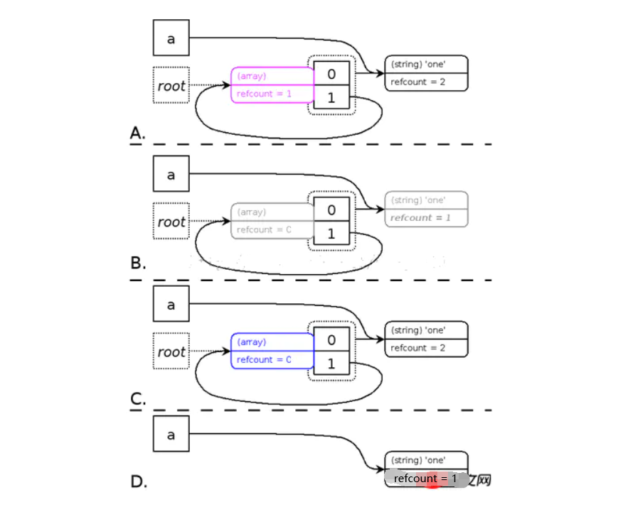

## PHP相关基础知识

1. [php底层原理之垃圾回收机制](https://juejin.im/post/5c7b785af265da2d8c7de5f1) 7>php>5.3
    
    确认垃圾准则
    * 如果引用计数减少到零，所在变量容器将被清除(free)，不属于垃圾
    * <em id='3'>[准则3]</em>如果一个zval 的引用计数减少后还大于0，可能为那么它会进入垃圾周期。其次，在一个垃圾周期中，通过检查引用计数是否减1，并且检查哪些变量容器的引用次数是零，来发现哪部分是垃圾。

    垃圾回收机制
    * 以PHP引用计数为基础
    * 由于5.3之前版本出现的循环引用导致内存泄漏的问题，引入根缓冲机制，即php启动时默认设定zval数量的根缓冲区（默认大小10000），当发现存在循环引用的zval时就会将其丢入缓冲区，当缓冲区达到上限进行垃圾回收。
    * PHP7之后所以不是所有的数据类型都会有引用计数操作，比如整型、浮点型、布尔、NULL这些简单数据类型都没有refcount了

    GC回收流程 [参考](https://www.jianshu.com/p/d73b3ca418b0)

    

    A：为了避免每次变量的refcount减少的时候都调用GC的算法进行垃圾判断，此算法会先把所有前面[准则3](#3)情况下的zval节点放入一个节点(root)缓冲区(root buffer)，并且将这些zval节点标记成紫色，同时算法必须确保每一个zval节点在缓冲区中之出现一次。当缓冲区被节点塞满的时候，GC才开始开始对缓冲区中的zval节点进行垃圾判断。
    
    B：当缓冲区满了之后，算法以深度优先对每一个节点所包含的zval进行减1操作，为了确保不会对同一个zval的refcount重复执行减1操作，一旦zval的refcount减1之后会将zval标记成灰色。需要强调的是，这个步骤中，起初节点zval本身不做减1操作，但是如果节点zval中包含的zval又指向了节点zval（环形引用），那么这个时候需要对节点zval进行减1操作。

    C：算法再次以深度优先判断每一个节点包含的zval的值，如果zval的refcount等于0，那么将其标记成白色(代表垃圾)，如果zval的refcount大于0，那么将对此zval以及其包含的zval进行refcount加1操作，这个是对非垃圾的还原操作，同时将这些zval的颜色变成黑色（zval的默认颜色属性）

    D：遍历zval节点，将C中标记成白色的节点zval释放掉。

    Seesion和GC
    
    [本地sesssion过期回收](http://www.nowamagic.net/librarys/veda/detail/542)

    [如何设置一个严格30分钟过期的Session](https://www.laruence.com/2012/01/10/2469.html)
    * [PHP Session拓展配置](https://www.php.net/manual/zh/session.configuration.php)
    ```php 
    session.gc_probability = 1; 
    //ession.gc_divisor 与 session.gc_probability 合起来定义了在每个会话初始化时启动 gc（garbage collection 垃圾回收）进程的概率。此概率用 gc_probability/gc_divisor 计算得来。例如 1/100 意味着在每个请求中有 1% 的概率启动 gc 进程。session.gc_divisor 默认为 100。
    session.gc_divisor = 100;
    session.gc_maxlifetime = 60*30 
    //session.gc_maxlifetime 指定过了多少秒之后数据就会被视为“垃圾”并被清除。 垃圾搜集可能会在 session 启动的时候开始（ 取决于session.gc_probability 和 session.gc_divisor）。
    session.cookie_lifetime = 60*30 
    //ession.gc_divisor 与 session.gc_probability 合起来定义了在每个会话初始化时启动 gc（garbage collection 垃圾回收）进程的概率。此概率用 gc_probability/gc_divisor 计算得来。例如 1/100 意味着在每个请求中有 1% 的概率启动 gc 进程。session.gc_divisor 默认为 100。
    ```
2. [用户请求流程](https://juejin.im/post/5c7b83de51882578860c3a44)
    
    1.  用户访问域名
    1. ->域名进行DNS解析
    1. ->请求到对应IP服务器和端口
    1. ->nginx监听到对应端口的请求
    1. ->nginx对url进行location匹配
    1. ->执行匹配location下的规则
    1. ->nginx转发请求给php-fpm
    1. ->php-fpm的worker进程监听到nginx请求
    1. ->worker进程执行请求
    1. ->worker进程返回执行结果给nginx
    1. ->nginx返回结果给用户
3. [CGI(Common Gateway Interface) ](https://zhuanlan.zhihu.com/p/25013398)
4. [CGI、FastCGI和PHP-FPM之间的关系](https://www.awaimai.com/371.html)，[FastCGI](https://github.com/reeze/tipi/blob/master/book/chapt02/02-02-03-fastcgi.markdown)
5. [Nginx 接收HTTP请求流程](https://www.codedump.info/post/20190131-nginx-read-http-request/)
6. PHP重定向方法
    1. `header('Location: http://www.baidu.com');`
    2. `<meta http-equiv="Refresh" content="0;url=http://www.baidu.com">`
    3. `echo '<script>window.location.href="www.baidu.com"</script>';`


7. 多服务器Session共享
    1. 不使用session，换用cookie. 

        session是存放在服务器端的，cookie是存放在客户端的，我们可以把用户访问页面产生的session放到cookie里面，就是以cookie为中转站。你访问web服务器A，产生了session然后把它放到cookie里面，当你的请求被分配到B服务器时，服务器B先判断服务器有没有这个session，如果没有，再去看看客户端的cookie里面有没有这个session，如果也没有，说明session真的不存，如果cookie里面有，就把cookie里面的sessoin同步到服务器B，这样就可以实现session的同步了。
    
        说明：这种方法实现起来简单，方便，也不会加大数据库的负担，但是如果客户端把cookie禁掉了的话，那么session就无从同步了，这样会给网站带来损失；cookie的安全性不高，虽然它已经加了密，但是还是可以伪造的。
    2. session存在数据库（MySQL）中
        
        PHP可以配置将session保存在数据库中，这种方法是把存放session的表和其他数据库表放在一起，如果mysql也做了集群的话，每个mysql节点都要有这张表，并且这张session表数据表要实时同步。
        
        但是要注意的是：用数据库来同步session，会加大数据库的IO，增加数据库的负担。而且数据库读写速度较慢，不利于session的适时同步。

    3. session存在memcache或者redis中
        
        memcache可以做分布式，php配置文件中设置存储方式为memcache，这样php自己会建立一个session集群，将session数据存储在memcache中。
        
        特别说明：
        
        以这种方式来同步session，不会加大数据库的负担，并且安全性比用cookie大大的提高，把session放到内存里面，比从文件中读取要快很多。但是memcache把内存分成很多种规格的存储块，有块就有大小，这种方式也就决定了，memcache不能完全利用内存，会产生内存碎片，如果存储块不足，还会产生内存溢出。

    4. 采用nginx中的ip_hash机制
        
        nginx中的ip_hash技术能够将某个ip的请求定向到同一台后端web机器中，这样一来这个ip下的某个客户端和某个后端web机器就能建立起稳固的session。
        
        也就是说，ip_hash机制能够让某一客户机在相当长的一段时间内只访问固定的后端的某台真实的Web服务器，这样会话就会得以保持，我们在网站页面进行login的时候，就不会在后面的web服务器之间跳来跳去了，自然也不会出现登陆一次后网站又提醒你没有登陆需要重新登陆的情况；

        **ip_hash是容易理解的，但是因为仅仅能用ip这个因子来分配后端web，因此ip_hash是有缺陷的，不能在一些情况下使用：**

            * nginx不是最前端的服务器。ip_hash要求nginx一定是最前端的服务器，否则nginx得不到正确ip，就不能根据ip作hash。譬如使用的是squid为最前端，那么nginx取ip时只能得到squid的服务器ip地址，用这个地址来作分流是肯定错乱的。
            * nginx的后端还有其它方式的负载均衡。假如nginx后端又有其它负载均衡，将请求又通过另外的方式分流了，那么某个客户端的请求肯定不能定位到同一台session应用服务器上。这么算起来，nginx后端只能直接指向应用服务器，或者再搭一个squid，然后指向应用服务器。最好的办法是用 location作一次分流，将需要session的部分请求通过ip_hash分流，剩下的走其它后端去。


    * [memcached实践](https://www.cnblogs.com/kevingrace/p/6031356.html)
    * [自定义redis session驱动](https://cloud.tencent.com/developer/article/1555716) 
    * [redis集群原理](https://github.com/phpredis/phpredis/blob/develop/cluster.markdown#readme)

8. 客户端禁用cookie怎么记录session_id ？

    ```php 
    session.use_cookies = 0 //指定是否在客户端用 cookie 来存放会话 ID。默认为 1（启用）。
    ```

9. 单点登录（Single Sign On）SSO的实现机制
    
    1. session共享
    2. token认证机制
    3. SAML 2.0
    4. OAuth 2.0
10. [浅谈SAML, OAuth, OpenID和SSO, JWT和Session](https://juejin.im/post/5b3eac6df265da0f8815e906)

11. 为什么要区分 refresh token 和 access token？

12. [API：认证、授权、凭证](http://www.woshipm.com/data-analysis/2134741.html)